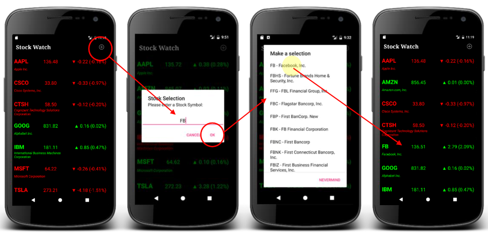
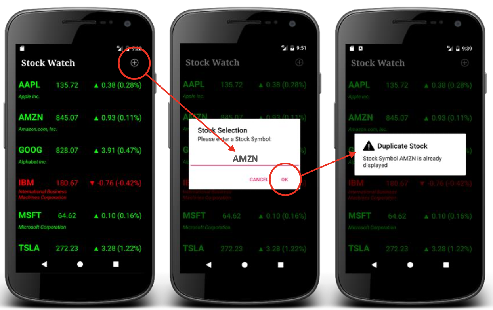
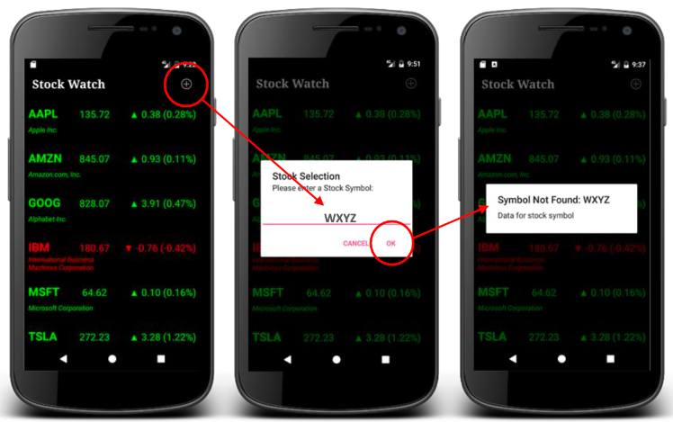
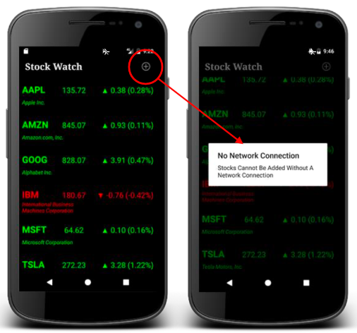
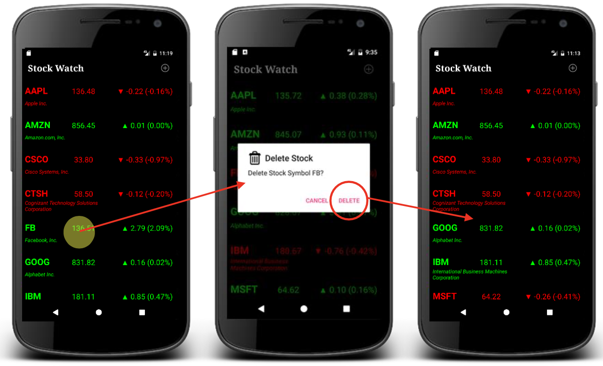
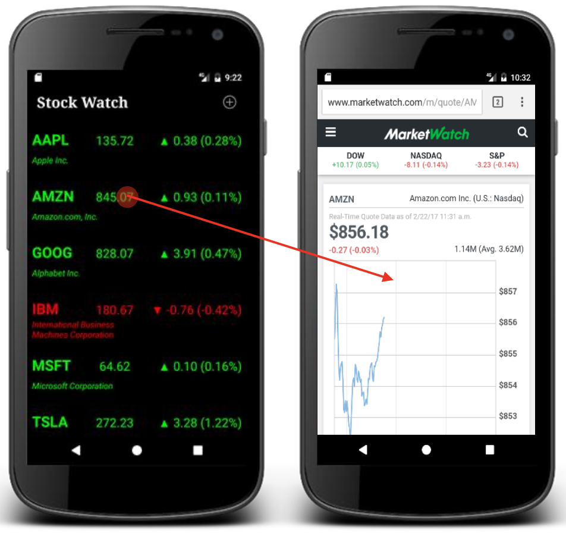

# Financial-Stock-Watch

Financial Stock Android Application (Android Studio) 

Allowing users to monitor user's saved stock preferences. Live updates of stock(s)' data from IEX Cloud REST API Calls.
This application is made using only 1 activity screen and implemented "RecyclerView & SwipRefreshLayout". 

Features:

-Search/Select/Add for specific stock(s) data-

Adding a specifict stock

Allows stock selection based on input

Preventing adding duplicate stocks 

Not found SYOMBOL 

-Network connection check-

-Long press stock to delete stock-

-Tap on stock to open default browser displaying stock's data or information via Stock Market Watch site-

-Swipe down to referesh stock(s) data-

NOTE: 
-Remove .gradle and build folder to build if error 
